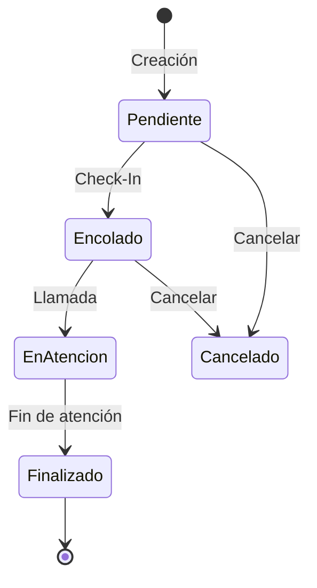
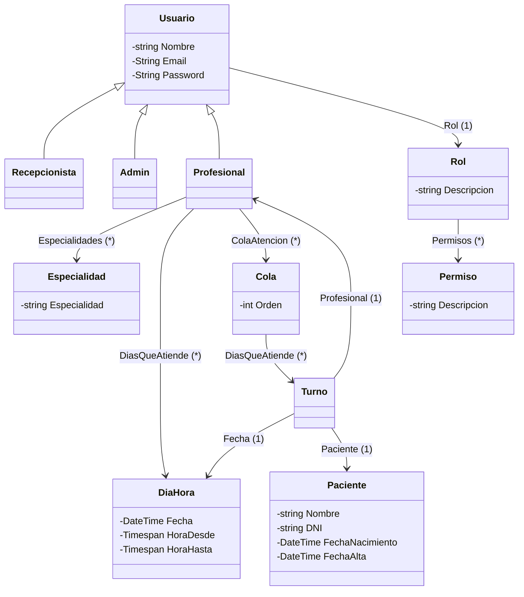

# NT1- Sistema de gestión de turnos (SGT)

## Roles

- Recepcionista
- Profesional
- Admin

## Flujo de estados del turno

### Acciones

> `Crear` --> Profesional | Recepcionista
>
> `Check-In` --> Recepcionista
> 
> `Llamar` --> Profesional
> 
> `FinDeAtencion`  --> Profesional
> 
> `Cancelar` --> Profesional | Recepcionista

### UML (Resumido)

